# Onboarding
Welcome to VEXU GHOST PCB team onboarding! This will give a brief introduction on using KiCAD and a general understanding in PCB design.
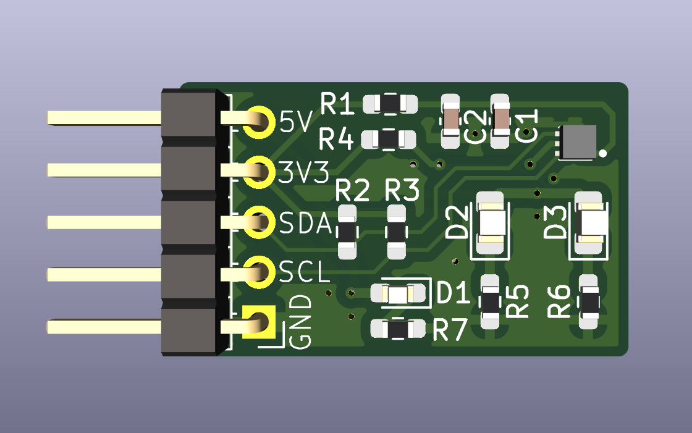

Follow these steps for the onboarding:

1. Download KiCAD V9.0+ (https://www.kicad.org/download/) and download Git (https://git-scm.com/install/windows)

2. Clone this repo by clicking the green code button, copying https (or ssh if you have ssh set up) link
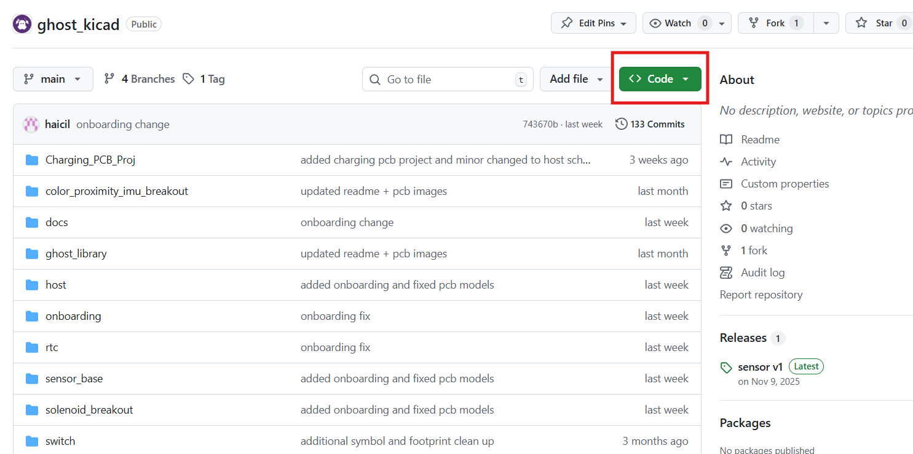
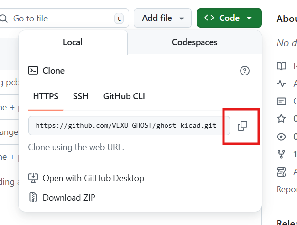

3. Type the following command in git bash to clone the repo
- right click > paste to paste in bash
- make sure to remove any characters not part of the https or ssh link
    '''
    git clone [paste the https/ssh link]
    '''

4. Open up the repo's directory and create a new remote branch with the name "Firstname_Lastname_Onboarding"
    '''
    cd ghost_kicad
    git branch Firstname_Lastname_Onboarding
    git checkout Firstname_Lastname_Onboarding
    '''

5. Open up your file explorer and find the “ghost_kicad” folder (should be in C:\\\\Users\\\\[name] unless you cloned the repo to another directory), open the onboarding KiCAD project in the "onboarding" folder

6. Open up the schematic and complete the schematic for the color sensor development board by following the image below (the schematic doesn't have to be exactly the same, but it is a good habit to section and partition different parts in your schematic)
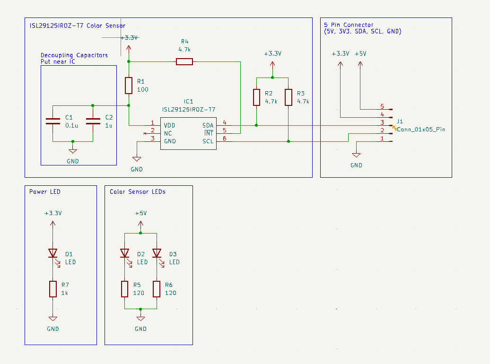
- to connect the different components together, click on a square node at a pin of the components to start a wire and connect it to another square node
- to place more 5V, 3V3, or GND symbols, you can copy and paste existing symbols or place new ones by using the power symbol button on the right side of the screen
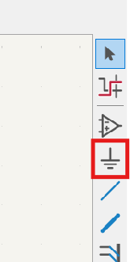
- to draw rectangles, do Place > Draw Rectangles
- to place text, use the text button on the right side of the screen
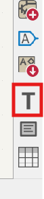

7. Check your schematic by running ERC (Inspect > Electrical Rule Checker), also ignore any errors on power output for 5V, 3V3, and GND

8. Assign footprints to the component (Tools > Assign Footprints) by following the image below
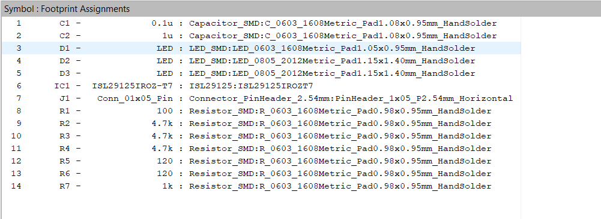

9. Transfer your schematic to the PCB editor (Tools > Update PCB from Schematic), click done, and place your component cluster down

10. Start creating your PCB layout by roughly positiong and lining up your components , the image below provides an example on how the PCB should turn out, but try to not copy everything one by one from image
- the more important components or the components with more pins should generally be placed in the middle, and related components with the same nets would be placed around them
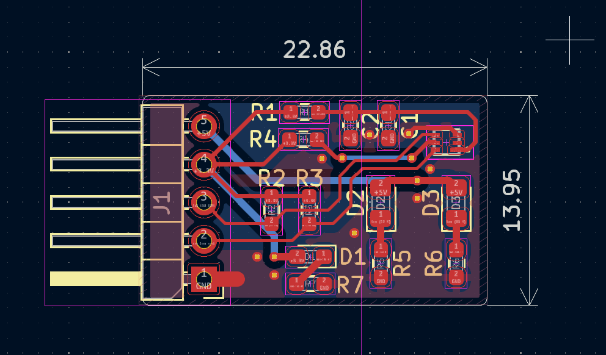

11. Once you placed all of your components, start placing traces and connecting nets indicated by the light blue lines by hovering over a pin or a pad and press x and click on the other highlighted pin or pad
- start with signal nets first and then do power nets, and don't connect GND nets and leave them for next step
- generally you should use larger trace widths for nets connected to the power nets, such as 0.3 mm or 0.5 mm, and other traces for signals can use the default width or 0.2mm, you can set the trace widths by clicking the track dropdown on the top left corner > edit pre-defined sizes > + sign at the bottom of the tracks column, and you can enter the value for the trace width
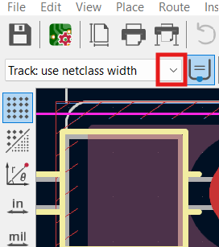
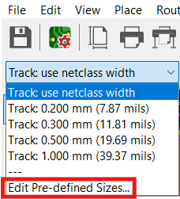
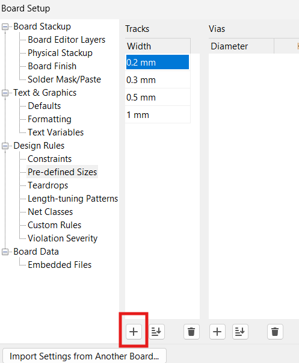

12. Once the components are all connected, create a GND plane on the front layer (and back layer if you want) by clicking the "Draw Filled Zone" button, then click on the components, select GND for the net, and draw a box around the components (double click to finish), finally press B to fill the zones with a layer of copper that is conencted to GND
- see if there is any GND nets that are left unconnected, use traces to connect them if there are
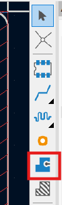
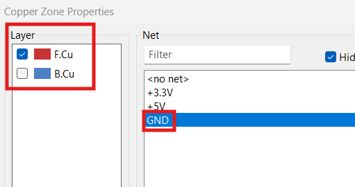

13. Go to the "Layers" list on the right of the screen and select "Edge.Cuts", then click the "Draw Rectangle" button, and draw a rectangle around the components and zones to create the final shape for your PCB
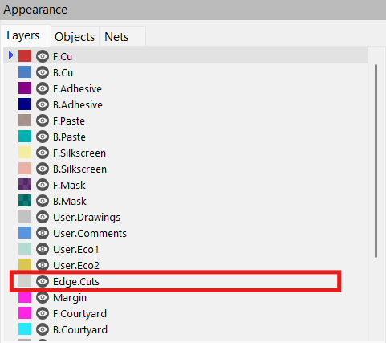
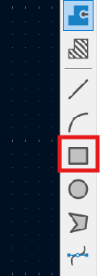

14. Check your PCB layout by running DRC (Inspect > Rule Checker), see if there is any errors on pads being not connected or traces and pads being too close to the edge cuts

15. Save your KiCAD files and ask another PCB team member to help you get added into the repo and our notion page

16. Once you have been added to the repo, go back to bash, change into the repo’s directory, commit those file changes onto git, and push them to your branches for us to review
    '''
    git add .
    git commit -m "finished onboarding"
    git push origin Firstname_Lastname_Onboarding
    '''